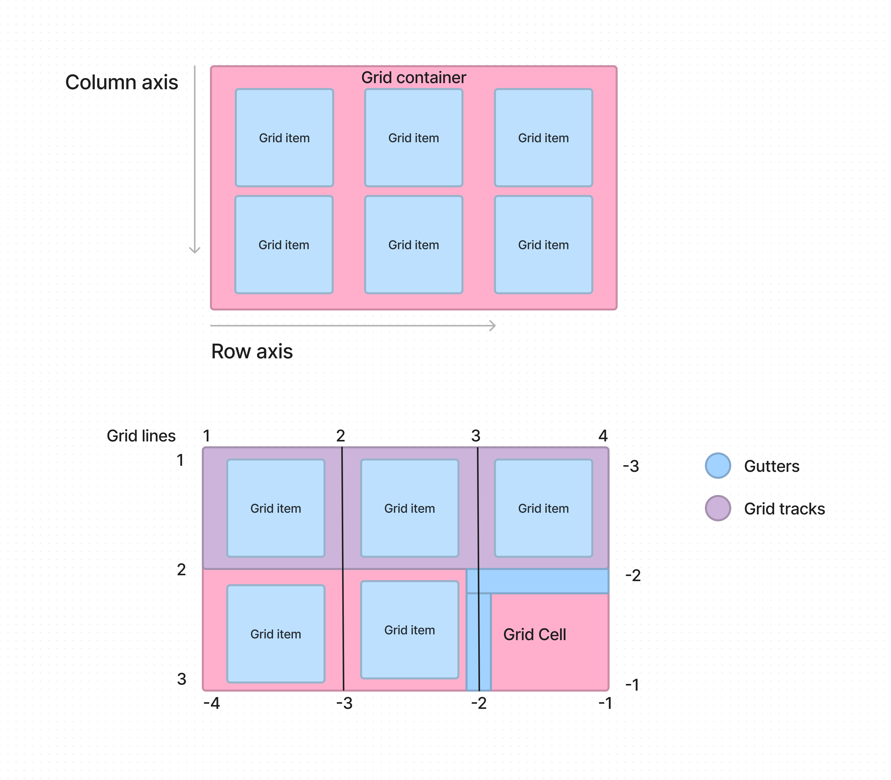

# Nexter

Udemy 線上課程 (Advanced CSS and Sass: Flexbox, Grid, Animations and More! by Jonas Schmedtmann) 中的第三份教材，使用 CSS Grid 進行排版布局

## Project Specification

- CSS grid

## Note

**CSS Grid**

用來打造 2 維排版的 CSS 屬性集，主要概念是排版 rows(列), columns(欄) 中的子元素

優點:

1. 較少的巢狀(nested) HTML
2. 更好閱讀的 CSS 程式碼

在此列上語法教學網站

> 💡References :
>
> [CSS trick](https://css-tricks.com/snippets/css/complete-guide-grid/)
>
> [MDN - grid](https://developer.mozilla.org/en-US/docs/Web/CSS/grid)
